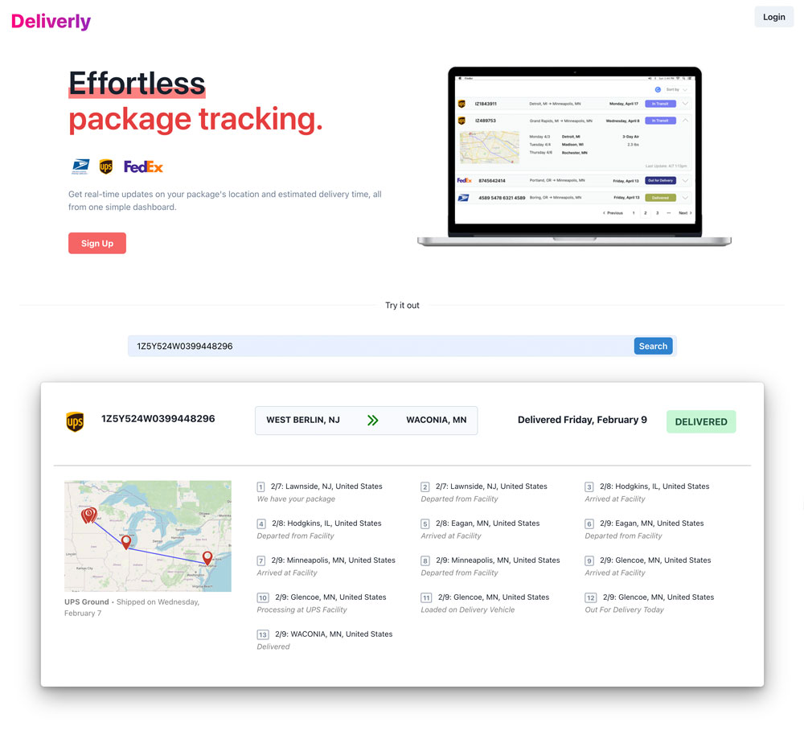
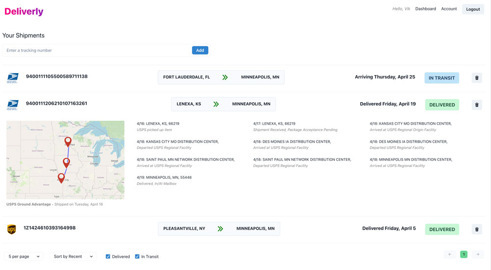

# Deliverly

Deliverly is an elegant alternative to tracking shipments from multiple carriers. In one mobile-friendly dashboard, a user can see shipment statuses from UPS, Fedex, and USPS, along with a real-time map of each checkpoint.

[Go to the deployed app](https://deliverly.onrender.com/)

On the homepage, a user can signup and login to their account, or quickly lookup a shipment.

Once a user is signed up and logged in, they can add and remove shipments and see all their statuses in an easy interface with collapsed cards. Expanding a card provides a detailed overview of the shipment type, dates, checkpoints, and a real-time map of the checkpoints and route.

For power users who have track many shipments, there are also options to sort and paginate by varying numbers of shipments per page.

## Tech Stack

Deliverly is a MERN app with GraphQL for the database functions and JWT for user authentication. For shipment data, it uses third-party API requests on the backend for status and checkpoint objects, which then pass into Geocoder for coordinates that generate a Base64 image via Static Maps. In this way, route images are created and cached on the fly, rather than getting stored in the database.

On the frontend, the app uses elegant modals for user signup and login, a custom component library for shipment cards, mobile-friendly navigation and card views, and lightweight React UI components for accordions, sorting, and pagination.

**Backend:** Node.js, Express, Mongoose, GraphQL, Apollo, JWT, Bcrypt.

**Frontend:** React, Vite, Chakra UI, Framer Motion, Ajna pagination.